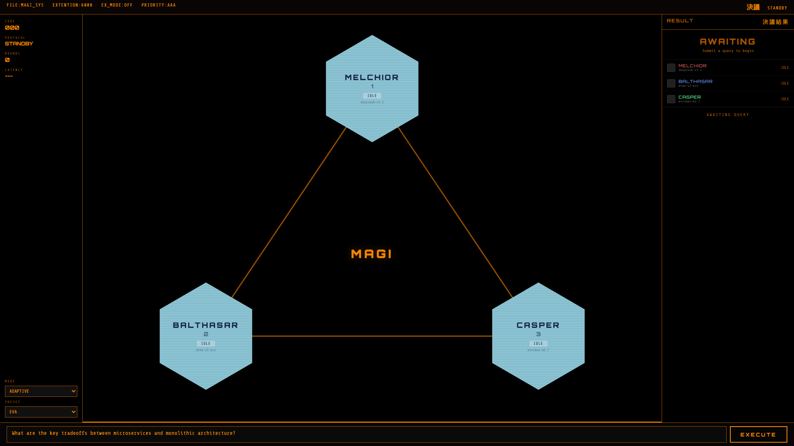

# MAGI — Disagreement OS for LLMs

Three models. One decision. Inspired by the [MAGI supercomputer](https://evangelion.fandom.com/wiki/MAGI) from Neon Genesis Evangelion.

MAGI is not another agent framework. It is a **structured disagreement engine**: the same question goes to three different LLMs, each with a different perspective. They vote, debate, and critique each other to produce a Decision Dossier with the ruling, confidence, minority report, and full trace.



## Why?

> Three cheap models using MAGI critique mode scored **88%** on our benchmark.
> A single Claude Sonnet 4.6 scored **76%**.
>
> Vote alone (72%) did not beat the single strong model.
> **Critique did.** The models caught each other's mistakes.

The value is not "more accurate answers." It is **better decision quality**: seeing where models agree, where they disagree, and why.

## How MAGI Differs

There are several EVA-inspired multi-model projects. Here's what makes this one different.

**Other projects do voting.** Three models answer, pick the majority. That's it.

**MAGI does structured disagreement.** Models don't just answer in parallel. They read each other's answers, critique the reasoning, and revise their positions across multiple rounds. The system tracks who changed their mind and why.

| Capability | Voting projects | MAGI |
|---|---|---|
| Multi-model query | Yes | Yes |
| Majority vote | Yes | Yes |
| **Multi-round critique (ICE)** | No | Yes |
| **Mind change tracking** | No | Yes |
| **Adaptive protocol selection** | No | Yes |
| **Minority report / dissent analysis** | No | Yes |
| **Benchmark: ensemble > single model** | No | Yes (88% > 76%) |
| **Fault tolerance (node failures)** | No | Yes |
| **NERV hexagonal dashboard** | No | Yes |
| **CLI toolchain (diff, judge, bench)** | No | Yes |

The key finding: **vote alone (72%) does not beat a single strong model (76%)**. Every voting-only project hits this ceiling. MAGI's critique mode breaks through it (88%) by letting models catch each other's mistakes.

A NeurIPS 2025 paper ([Debate or Vote](https://arxiv.org/abs/2508.17536)) found that "debate doesn't systematically improve beliefs." But their debate asks models to persuade humans. MAGI's ICE protocol asks models to find errors in each other's reasoning. Different mechanism, different result.

## Install

```bash
pip install magi-system
```

Or from source:

```bash
git clone https://github.com/fshiori/magi.git
cd magi
pip install -e ".[dev]"
```

## Quick Start

```bash
# Multi-model code review (the killer use case)
magi diff --staged

# Ask a question with three perspectives
magi ask "Should we use microservices or a monolith?"

# Use critique mode for higher quality (slower, but models debate)
magi ask "Is Rust better than Go for backend services?" --mode critique

# Adaptive mode: auto-selects vote/critique/escalate based on disagreement
magi ask "What caused the 2008 financial crisis?" --mode adaptive

# Multi-model answer scoring
magi judge -q "What is quantum entanglement?" -a "It means particles are connected"

# Run benchmark
magi bench

# View decision analytics
magi analytics

# Replay a specific decision
magi replay <trace-id>

# List persona presets
magi presets
```

## How It Works

```
  You ──▶ MAGI Engine ──▶ 3 LLMs in parallel ──▶ Protocol ──▶ Decision Dossier
                              │                       │
                         Melchior               Vote (fast)
                         Balthasar          Critique (debate)
                         Casper            Adaptive (auto)
```

Each Decision Dossier contains:

- **Ruling** — the final answer
- **Confidence** — how much the models agreed (0-100%)
- **Minority Report** — dissenting opinions and why they disagree
- **Mind Changes** — which models changed position during debate
- **Trace** — full JSONL history for replay and analytics

## Protocols

| Protocol | When to use | How it works |
|----------|-------------|--------------|
| `vote` | Fast answers, clear-cut questions | Parallel query, structured position extraction, majority wins |
| `critique` | Complex or controversial questions | Multi-round debate (ICE), models critique each other until consensus |
| `escalate` | Forced decision on high-disagreement topics | Critique with 2-round limit, highest-trust node makes final call |
| `adaptive` | Default for most use cases | Auto-selects based on agreement score: high=vote, medium=critique, low=escalate |

## Persona Presets

MAGI comes with 5 built-in perspective sets:

```
$ magi presets

  code-review     Security Analyst / Performance Engineer / Code Quality Reviewer
  eva             Melchior / Balthasar / Casper
  research        Methodologist / Domain Expert / Devil's Advocate
  strategy        Optimist / Pessimist / Pragmatist
  writing         Editor / Reader Advocate / Fact Checker
```

```bash
# Use a specific preset
magi ask "Should we expand to the EU market?" --preset strategy

# magi diff always uses code-review preset automatically
```

## Python API

```python
import asyncio
from magi import MAGI

engine = MAGI(
    melchior="claude-sonnet-4-6",
    balthasar="gpt-4o",
    casper="gemini/gemini-2.5-pro",
)

decision = asyncio.run(engine.ask(
    "What are the security implications of this API design?",
    mode="adaptive",
))

print(decision.ruling)          # The final answer
print(decision.confidence)      # 0.0 - 1.0
print(decision.minority_report) # Dissenting views
print(decision.mind_changes)    # Who changed their mind
print(decision.protocol_used)   # Which protocol was selected
```

## Configuration

MAGI uses [LiteLLM](https://github.com/BerriAI/litellm) under the hood, so it supports 100+ LLM providers.

### API Keys

```bash
# Direct providers
export OPENAI_API_KEY=sk-...
export ANTHROPIC_API_KEY=sk-ant-...
export GOOGLE_API_KEY=AI...

# Or use OpenRouter for all models with one key
export OPENROUTER_API_KEY=sk-or-...
```

### Using OpenRouter

```bash
magi ask "your question" \
  --melchior openrouter/anthropic/claude-sonnet-4.6 \
  --balthasar openrouter/openai/gpt-4o \
  --casper openrouter/google/gemini-2.5-pro
```

## Benchmark Results

Tested on 25 MMLU-style questions across 5 categories:

| Group | Accuracy | Time | Errors |
|-------|----------|------|--------|
| Claude Sonnet 4.6 (single) | 76% | 128s | 1 |
| 3x Cheap Models (vote) | 72% | 1745s | 0 |
| **3x Cheap Models (critique)** | **88%** | 1577s | 0 |

Models used: Xiaomi MiMo-v2-pro, MiniMax M2.7, DeepSeek V3.2

**Key finding:** Vote alone doesn't beat a strong single model. Critique mode does, by letting models catch each other's mistakes through structured debate.

## Fault Tolerance

MAGI keeps working when models fail:

- **1 of 3 fails** — continues with 2 nodes, marks decision as degraded
- **2 of 3 fail** — falls back to single model response
- **All 3 fail** — raises `MagiUnavailableError` (never guesses)
- **Timeouts** — 30s default per node, exponential backoff on rate limits
- **Reasoning models** — automatically extracts from `reasoning_content` (e.g., MiniMax M2.7)

## Project Structure

```
magi/
├── core/
│   ├── engine.py       # MAGI engine, coordinates nodes
│   ├── node.py         # LLM node wrapper with persona
│   └── decision.py     # Decision dossier dataclass
├── protocols/
│   ├── vote.py         # Structured voting with position extraction
│   ├── critique.py     # ICE (Iterative Consensus Ensemble)
│   └── adaptive.py     # Dynamic protocol selection
├── commands/
│   ├── diff.py         # Multi-model code review
│   ├── judge.py        # Multi-model answer scoring
│   └── analytics.py    # Trace analysis and replay
├── presets/             # Persona preset definitions
├── bench/              # Benchmark runner and datasets
├── trace/              # JSONL trace logging
└── cli.py              # Click CLI entry point
```

## Development

```bash
git clone https://github.com/fshiori/magi.git
cd magi
uv venv && uv pip install -e ".[dev]"
python -m pytest tests/ -v
```

83 tests covering all protocols, degradation modes, and edge cases.

## Roadmap

- [ ] MAGI-as-API-Gateway — OpenAI-compatible proxy, any app just changes `base_url`
- [ ] NERV Command Center UI — real-time visualization of the decision process
- [ ] LLM-as-judge agreement scoring (replace word-overlap heuristic)
- [ ] Scorecard weighted voting (after sufficient data collection)
- [ ] PyPI publish

## Name

In Evangelion, MAGI is a trio of supercomputers created by Dr. Naoko Akagi. Each embodies a different aspect of her personality: **Melchior** (the scientist), **Balthasar** (the mother), and **Casper** (the woman). Decisions are made by majority vote among the three.

MAGI applies this concept to LLMs: same question, three different perspectives, structured disagreement produces better decisions than any single model alone.

## License

MIT
